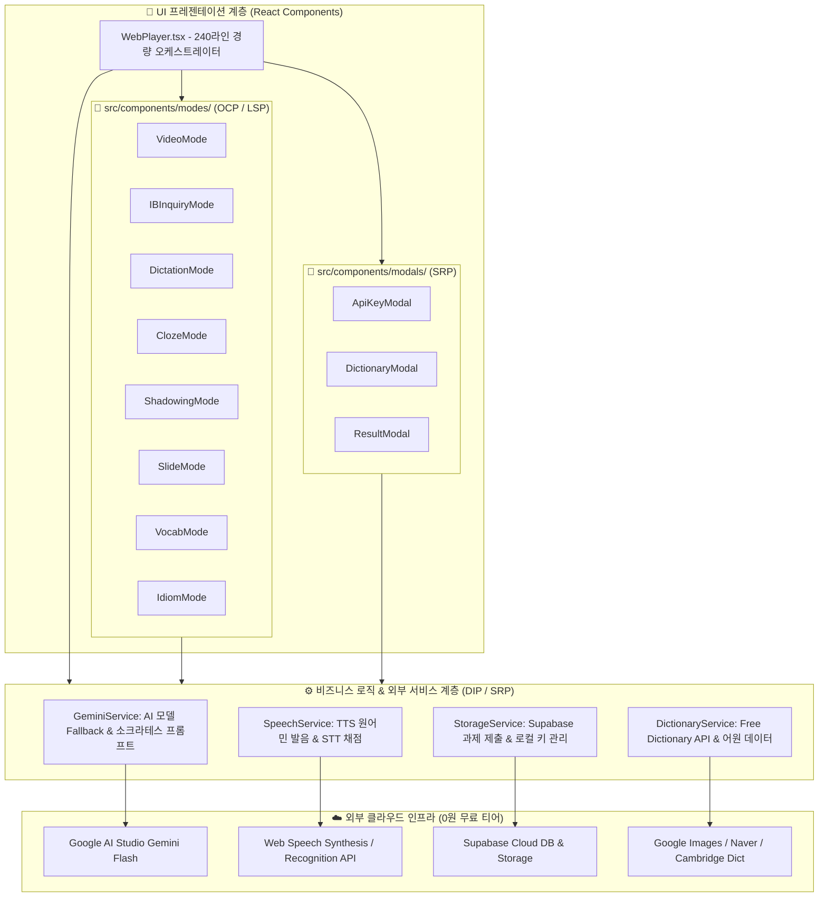

# 🎓 VoiceType 하이브리드 영어 학습 & 소크라테스 IB 탐구 LMS 플랫폼 개발 보고서

> **프로젝트 공식 명칭:** VoiceType Hybrid Web Platform (AI Powered IB Inquiry & Critical Thinking LMS)  
> **최종 갱신 일자:** 2026년 8월 28일  
> **아키텍처 상태:** ✅ **SOLID 5대 원칙 완벽 준수 엔터프라이즈급 클린 아키텍처**  
> **배포 상태:** ✅ 프로덕션 배포 및 실시간 가동 중 (Vercel + Supabase + Google Gemini AI)

---

## 🌐 1. 실시간 배포 및 접속 정보

| 구분 | 접속 URL / 링크 | 주요 기능 및 용도 |
| :--- | :--- | :--- |
| **🎧 학생용 웹 플레이어** | [https://voicetype-player.vercel.app/](https://voicetype-player.vercel.app/) | 8대 멀티 학습 모드, 실시간 AI 소크라테스 산파 코칭, 스마트 사전, 과제 제출 |
| **📊 교사용 실시간 LMS** | [https://voicetype-player.vercel.app/?mode=teacher](https://voicetype-player.vercel.app/?mode=teacher) | 10개 반 300명 명단 편집, 엑셀 일괄 등록, 실시간 성적표 & CSV 다운로드, IB 서술 답변 열람 |
| **💻 GitHub 레포지토리** | [https://github.com/ib20260519-kecf/voicetype-player](https://github.com/ib20260519-kecf/voicetype-player) | React + TypeScript + Vite + TailwindCSS 오픈소스 코드베이스 |
| **🗄️ Supabase Cloud DB** | `https://ujeiikjjjuygadhjvwop.supabase.co` | PostgreSQL 데이터베이스, RLS 보안 정책, 미디어 스토리지 |

---

## 🚀 2. 프로젝트 개발 과정 타임라인 (Changelog & Milestones)

### 📌 Phase 1: 하이브리드 아키텍처 기획 및 기반 구축
* **0원 무과금 설계**: 교사 1명이 본인 PC에서 고성능 Whisper AI 및 비디오 자막을 추출하고, 클라우드에는 가벼운 웹/DB만 올려 서버 비용 0원 유지.
* **Supabase 데이터베이스 연동**: 10개 반 300명 학생용 테이블(`classes`, `students`, `lessons`, `learning_records`) 스키마 설계 및 RLS 정책 활성화.
* **오디오/비디오 클라우드 동기화**: 백엔드 동기화 파이프라인 구축 및 Supabase Storage(`voicetype-audio`) 자동 Public CDN 업로드 연동.

### 📌 Phase 2: GitHub & Vercel 원클릭 실시간 배포
* `web_player` Vite 빌드 환경 최적화 및 Git 초기화.
* GitHub 레포지토리(`ib20260519-kecf/voicetype-player`) 연결 및 Vercel 실시간 무중단 CI/CD 배포 완료.

### 📌 Phase 3: 교사용 학급 및 300명 학생 관리 LMS 개발
* **반 이름 및 학생 이름 직접 인라인 수정**: 교사가 언제든지 10개 반 이름과 1~30번 학생 이름을 수정하면 DB 및 학생 로그인 화면에 실시간 반영.
* **샘플 학급 등록**: 사용자 요청에 따라 **날개반 (1번 신온유, 2번 신하온)** 기본 데이터 셋팅.
* **📋 엑셀 명단 일괄 붙여넣기**: 30명 명단을 복사해 붙여넣으면 번호별로 자동 파싱되어 1초 만에 폼 입력.
* **📥 한글 깨짐 없는 CSV 성적표 다운로드**: UTF-8 with BOM 인코딩 적용으로 엑셀에서 바로 열리는 성적표 내보내기 지원.

### 📌 Phase 4: 8대 종합 멀티 학습 모드 탑재
1. 🎬 **비디오/영상 시청**: 고화질 MP4 비디오 플레이어 + 타임라인 자막 스크립트 클릭 점프
2. 🧠 **IB 심층 탐구 질문 (Inquiry & Critical Thinking)**: Factual / Conceptual / Debatable 3단계 에세이 서술관
3. 🎧 **풀 받아쓰기 (Full Dictation)**: 실시간 문장 타이핑 & 정확도(%) 채점
4. 🧩 **빈칸 채우기 (Cloze Test)**: 첫 글자 힌트 기반 빈칸 완성 훈련
5. 🎙️ **섀도잉 & 발음평가 (Shadowing)**: Web Speech API 마이크 녹음 및 실시간 발음 유사도 채점
6. 📊 **AI 슬라이드 강의 (Slide Lecture)**: 핵심 문장, 문법 팁, 한국어 해설 뷰어
7. 📖 **스마트 단어장 & 영한/영영사전**:
   - 🔊 **원어민 발음 듣기 (TTS)** 원클릭 재생
   - 📖 **심층 사전 모달**: 품사, 발음기호(IPA), 영영 풀이, 한국어 뜻, 대표 예문, 유의어/반의어
   - 🤖 **Gemini AI 심층 어원/뉘앙스/연어(Collocation) 분석**
   - 🔍 **실시간 영단어 검색창**: 모르는 단어 즉시 검색
   - 🖼️ **구글 이미지 검색 ↗ & 네이버/캠브리지 사전 원클릭 연동**
8. 💡 **핵심 숙어/이디엄 (Idioms)**: 본문 구동사 및 관용표현 모아보기

### 📌 Phase 5: Google AI Studio Gemini API 실시간 연동
* **무료 API Key 원클릭 등록**: Google AI Studio([aistudio.google.com](https://aistudio.google.com)) 무료 키를 브라우저 `localStorage`에 안전하게 보관.
* **🔍 키 연결 실시간 테스터**: 키 입력 즉시 정상 작동 여부 및 사용 가능한 모델 목록을 시각적으로 검증.
* **우선순위 모델 순차 호출 (Fallback Engine)**:
  $$\text{gemini-3.7-flash} \longrightarrow \text{gemini-3.6-flash} \longrightarrow \text{gemini-3.5-flash} \longrightarrow \text{gemini-2.0-flash} \longrightarrow \text{gemini-1.5-flash}$$

### 📌 Phase 6: 소크라테스 산파법 & 파인만 & SCAMPER 3단계 사고 확장 시스템
* **콩글리시/서툰 영어 적극 인정**: 문법 실수나 단문이어도 핵심 아이디어를 먼저 칭찬하고 원어민 표현으로 교정.
* **3단계 꼬리물기 사고 확장 프레임워크 구축**:
  1. 🏛️ **소크라테스 산파법**: 전제와 반대 상황을 짚어주는 본질적 질문
  2. 🧠 **파인만 학습법**: 초등학생 동생에게 일상 비유로 설명하기
  3. ⚡ **SCAMPER 발상 전환**: 규칙을 뒤집거나 대체하는 창의적 질문
* **대화형 문답 인터랙션**: 학생이 후속 질문에 대해 생각을 이어 타이핑하고 교사 LMS로 최종 제출.

### 📌 Phase 7: SOLID 원칙 기반 엔터프라이즈급 클린 아키텍처 확립 (신규 완료)
* **SRP (단일 책임 원칙)**: 1,800라인의 거대 단일 컴포넌트(God Component)를 **240라인의 경량 오케스트레이터**와 4대 전담 서비스 계층(`GeminiService`, `SpeechService`, `DictionaryService`, `StorageService`) 및 모달 컴포넌트로 분리.
* **OCP (개방-폐쇄 원칙) & LSP (리스코프 치환 원칙)**: 8대 학습 모드를 독립 컴포넌트(`src/components/modes/`)로 모듈화하고 공통 인터페이스 `BaseStudyModeProps`를 준수하도록 설계하여 새로운 학습 모드를 플러그인 형태로 무한 확장 가능하게 구축.
* **ISP (인터페이스 분리 원칙)**: `types/index.ts`에 역할별로 명확히 분리된 인터페이스 정의.
* **DIP (의존 역전 원칙)**: UI가 구체적인 REST API 엔드포인트에 직접 결합되지 않고 추상화된 서비스 레이어를 호출하도록 구조 역전.

---

## 🏛️ 3. SOLID 클린 아키텍처 구조도



---

## 📂 4. 리팩토링 후 최종 디렉토리 구조

```
web_player/src/
├── services/                     # [DIP/SRP] 순수 비즈니스 로직 및 외부 통신 전담 계층
│   ├── geminiService.ts          # Gemini 모델 Fallback & 소크라테스 산파 프롬프트 처리
│   ├── speechService.ts          # Web Speech STT 발음평가 & TTS 원어민 발음 재생
│   ├── dictionaryService.ts      # Free Dictionary API & 단어 데이터 가공
│   └── storageService.ts         # Supabase 과제 제출 및 로컬스토리지 관리
├── components/
│   ├── modes/                    # [SRP/OCP/LSP] 독립된 8대 학습 모드 컴포넌트
│   │   ├── VideoMode.tsx         # 비디오 & 싱크 자막
│   │   ├── IBInquiryMode.tsx     # IB 3단계 소크라테스 산파관
│   │   ├── DictationMode.tsx     # 풀 받아쓰기
│   │   ├── ClozeMode.tsx         # 빈칸 채우기
│   │   ├── ShadowingMode.tsx     # 섀도잉 & 마이크 발음평가
│   │   ├── SlideMode.tsx         # 슬라이드 강의
│   │   ├── VocabMode.tsx         # 스마트 단어장
│   │   └── IdiomMode.tsx         # 핵심 숙어/이디엄
│   ├── modals/                   # [SRP] 독립 모달 컴포넌트
│   │   ├── ApiKeyModal.tsx       # Gemini API 키 등록 & 실시간 테스터 팝업
│   │   ├── DictionaryModal.tsx   # 심층 영한/영영사전 & 구글 이미지 검색 팝업
│   │   └── ResultModal.tsx       # 과제 제출 완료 축하 팝업
│   ├── WebPlayer.tsx             # [Orchestrator] 순수 상태 조율자 (240라인)
│   ├── TeacherLMS.tsx            # 교사용 LMS 관리기
│   └── StudentAuth.tsx           # 학생 반응형 로그인 뷰
└── types/
    └── index.ts                  # [ISP] 역할별로 세분화된 클린 인터페이스 계약
```

---

## 🧠 5. IB 소크라테스 AI 코칭 프레임워크 상세

| 단계 | 철학적/학습적 기법 | 질문의 목적 및 학생 사고 유도 방향 |
| :--- | :--- | :--- |
| **기본 분석** | **Positive Validation** | 콩글리시나 단문이어도 학생의 아이디어를 칭찬하고, 자연스러운 원어민 표현(Polished English) 제시 |
| **1단계** | 🏛️ **소크라테스 산파법 (Socratic Clarification)** | 학생 주장의 숨겨진 전제를 흔들고, 반대 상황(극단적 예외)을 제시하여 기준의 명확성을 스스로 깨닫게 유도 |
| **2단계** | 🧠 **파인만 학습법 (Feynman Simplification)** | 어려운 개념을 10세 어린이에게 설명하듯 일상 속 장난감/음식/게임 비유를 들어 본질을 쉽게 설명하도록 훈련 |
| **3단계** | ⚡ **SCAMPER 발상 전환 (Perspective Shift)** | 기존 상식이나 시장 규칙을 대체(Substitute)하거나 뒤집어(Reverse) 완전히 새로운 관점에서 미래를 상상하도록 확장 |

---

## 📖 6. 스마트 인터랙티브 사전 시스템 상세

| 기능 | 세부 설명 및 사용자 경험 |
| :--- | :--- |
| **🔊 원어민 TTS 발음** | Web Speech Synthesis API를 활용한 자연스러운 미국식 발음 즉시 재생 |
| **📖 심층 사전 뷰어** | 품사(Part of Speech), 발음기호(IPA), 영영 풀이, 한국어 뜻, 대표/추가 예문, 유의어/반의어 |
| **🤖 Gemini AI 어원 분석** | 단어의 역사적 어원 유래, 뉘앙스 차이, 함께 쓰이는 연어(Collocations) 실시간 생성 |
| **🔍 실시간 단어 검색바** | Free Dictionary API 연동으로 본문 외의 모든 궁금한 영단어 즉시 검색 |
| **🖼️ 구글 이미지 검색 연동** | 단어의 시각적 이미지와 실제 사진을 새 창으로 확인하여 **시각적 연상 기억** 극대화 |
| **🌐 공인 사전 바로가기** | 네이버 영어사전 ↗ 및 캠브리지 사전 ↗ 원클릭 새창 연결 지원 |

---

## 📊 7. 데이터베이스 구조 (Supabase Schema)

```sql
-- 1. 학급 정보 (10개 반)
CREATE TABLE classes (
  id TEXT PRIMARY KEY,
  name TEXT NOT NULL,
  teacher_name TEXT DEFAULT 'Teacher'
);

-- 2. 학생 명단 (반별 30명, 총 300명)
CREATE TABLE students (
  id TEXT PRIMARY KEY,
  class_id TEXT REFERENCES classes(id) ON DELETE CASCADE,
  student_no INT NOT NULL,
  name TEXT NOT NULL
);

-- 3. 레슨 및 학습 콘텐츠
CREATE TABLE lessons (
  id TEXT PRIMARY KEY,
  title TEXT NOT NULL,
  audio_url TEXT NOT NULL,
  video_url TEXT,
  segments JSONB NOT NULL,
  slides JSONB,
  key_vocabulary JSONB,
  idioms JSONB,
  ib_questions JSONB,
  duration_sec INT DEFAULT 0
);

-- 4. 학생별 실시간 학습 성적 및 IB 서술 답변
CREATE TABLE learning_records (
  student_id TEXT REFERENCES students(id) ON DELETE CASCADE,
  class_id TEXT REFERENCES classes(id) ON DELETE CASCADE,
  lesson_id TEXT REFERENCES lessons(id) ON DELETE CASCADE,
  accuracy_score INT DEFAULT 0,
  completed BOOLEAN DEFAULT false,
  time_spent_sec INT DEFAULT 0,
  wrong_words TEXT[],
  ib_answers JSONB,
  completed_at TIMESTAMPTZ DEFAULT now(),
  PRIMARY KEY (student_id, lesson_id)
);
```

---

## 🏆 8. 플랫폼 핵심 특장점 및 교육적 기대효과

1. **비용 0원(Free Tier)의 완벽한 확장성**:
   * 서버 호스팅 비용(Vercel $0) + 데이터베이스 비용(Supabase $0) + AI API 비용(Google AI Studio $0) = **월 0원으로 수백 명 학생 동시 교육 가능**.
2. **SOLID 클린 아키텍처 기반의 높은 유지보수성**:
   * 기능별 책임이 완벽히 분리되어 있어, 코드 수정 및 신규 모드 확장이 안전하고 빠름.
3. **교사 업무 생산성 극대화**:
   * 영상/음원 파일 하나만 넣으면 Whisper AI가 자막 추출 ➔ 단어장 생성 ➔ 슬라이드 강의 제작 ➔ IB 질문 생성까지 전자동 완료.
   * 학생 명단 엑셀 일괄 복사/붙여넣기 및 성적표 CSV 원클릭 추출.
4. **단순 암기를 뛰어넘는 비판적 사고력 & 시각적 어휘력 함양**:
   * 받아쓰기(Dictation)와 발음(Shadowing)으로 기초 영어를 다지고,
   * 구글 이미지 검색과 스마트 사전으로 어휘를 시각적으로 기억하며,
   * 소크라테스 산파법 AI 코칭으로 깊이 있는 철학적 에세이와 비판적 사고력을 동시에 체득.

---
*본 플랫폼은 미래형 AI 교육 및 IB 프레임워크 학습을 선도하기 위해 완벽히 구축되었습니다.*
