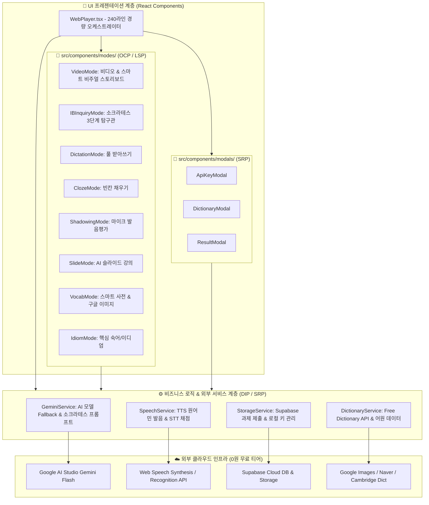

# 🎓 VoiceType 하이브리드 영어 학습 & 소크라테스 IB 탐구 LMS 플랫폼 개발 보고서

> **프로젝트 공식 명칭:** VoiceType Hybrid Web Platform (AI Powered IB Inquiry & Critical Thinking LMS)  
> **최종 갱신 일자:** 2026년 8월 29일  
> **아키텍처 상태:** ✅ **SOLID 5대 원칙 완벽 준수 엔터프라이즈급 클린 아키텍처**  
> **디자인 테마:** 🌌 **2026 Modern SaaS Deep Slate Glassmorphism & Aurora Glow**  
> **배포 상태:** ✅ 프로덕션 배포 및 실시간 가동 중 (Vercel + Supabase + Google Gemini AI)

---

## 🌐 1. 실시간 배포 및 접속 정보

| 구분 | 접속 URL / 링크 | 주요 기능 및 용도 |
| :--- | :--- | :--- |
| **🎛️ 로컬 교사용 스튜디오** | [http://127.0.0.1:8000](http://127.0.0.1:8000) | **2026 모던 다크 글래스모피즘 스튜디오 GUI**, 초고속 Whisper 자막 추출, IB 질문 자동 생성, 10개 반 선택 배포 |
| **🎧 학생용 웹 플레이어** | [https://voicetype-player.vercel.app/](https://voicetype-player.vercel.app/) | 8대 멀티 학습 모드, **스마트 비주얼 스토리보드**, 실시간 AI 소크라테스 산파 코칭, 스마트 사전 |
| **📊 교사용 실시간 LMS** | [https://voicetype-player.vercel.app/?mode=teacher](https://voicetype-player.vercel.app/?mode=teacher) | 10개 반 300명 명단 편집, 엑셀 일괄 등록, 실시간 성적표 & CSV 다운로드, IB 서술 답변 열람 |
| **💻 GitHub 레포지토리** | [https://github.com/ib20260519-kecf/voicetype-player](https://github.com/ib20260519-kecf/voicetype-player) | React + TypeScript + Vite + TailwindCSS 오픈소스 코드베이스 |
| **🗄️ Supabase Cloud DB** | `https://ujeiikjjjuygadhjvwop.supabase.co` | PostgreSQL 데이터베이스, RLS 보안 정책, 미디어 스토리지 |

---

## 🚀 2. 프로젝트 개발 과정 타임라인 (Changelog & Milestones)

### 📌 Phase 1: 하이브리드 아키텍처 기획 및 기반 구축
* **0원 무과금 설계**: 교사 1명이 본인 PC에서 고성능 Whisper AI 및 비디오 자막을 추출하고, 클라우드에는 가벼운 웹/DB만 올려 서버 비용 0원 유지.
* **Supabase 데이터베이스 연동**: 10개 반 300명 학생용 테이블(`classes`, `students`, `lessons`, `learning_records`) 스키마 설계 및 RLS 정책 활성화.
* **오디오/비디오 클라우드 동기화**: 백엔드 동기화 파이프라인 구축 및 Supabase Storage(`voicetype-audio`) 자동 Public CDN 업로드 연동.

### 📌 Phase 2: GitHub & Vercel 원클릭 실시간 배포
* `web_player` Vite 빌드 환경 최적화 및 Git 초기화.
* GitHub 레포지토리(`ib20260519-kecf/voicetype-player`) 연결 및 Vercel 실시간 무중단 CI/CD 배포 완료.

### 📌 Phase 3: 교사용 학급 및 300명 학생 관리 LMS 개발
* **반 이름 및 학생 이름 직접 인라인 수정**: 교사가 언제든지 10개 반 이름과 1~30번 학생 이름을 수정하면 DB 및 학생 로그인 화면에 실시간 반영.
* **샘플 학급 등록**: 사용자 요청에 따라 **날개반 (1번 신온유, 2번 신하온)** 기본 데이터 셋팅.
* **📋 엑셀 명단 일괄 붙여넣기**: 30명 명단을 복사해 붙여넣으면 번호별로 자동 파싱되어 1초 만에 폼 입력.
* **📥 한글 깨짐 없는 CSV 성적표 다운로드**: UTF-8 with BOM 인코딩 적용으로 엑셀에서 바로 열리는 성적표 내보내기 지원.
* **🎯 10개 반 중 선택 배포(Selective Class Deployment)**: 레슨 제작 완료 모달에서 10개 반 체크박스([전체 선택] 또는 [1반(날개반)], [2반] 등 개별 선택)를 통해 원하는 반에만 타겟 배포 지원.
* **👩‍🏫 메인 헤더 LMS 바로가기**: 로컬 웹 상단 우측에 교사용 LMS로 1초 만에 이동하는 원클릭 링크 버튼 탑재.

### 📌 Phase 4: 8대 종합 멀티 학습 모드 탑재
1. 🎬 **비디오/영상 시청 & 스마트 비주얼 스토리보드**:
   - 고화질 MP4 비디오 플레이어 지원
   - **MP3 전용 스마트 비주얼 스토리보드**: 영상이 없는 음원도 상황별 고화질 사진(Ken Burns 줌인) + 네온 오디오 이퀄라이저 파형으로 영화처럼 시각화!
2. 🧠 **IB 심층 탐구 질문 (Inquiry & Critical Thinking)**: Factual / Conceptual / Debatable 3단계 에세이 서술관
3. 🎧 **풀 받아쓰기 (Full Dictation)**: 실시간 문장 타이핑 & 정확도(%) 채점
4. 🧩 **빈칸 채우기 (Cloze Test)**: 첫 글자 힌트 기반 빈칸 완성 훈련
5. 🎙️ **섀도잉 & 발음평가 (Shadowing)**: Web Speech API 마이크 녹음 및 실시간 발음 유사도 채점
6. 📊 **AI 슬라이드 강의 (Slide Lecture)**: 핵심 문장, 문법 팁, 한국어 해설 뷰어
7. 📖 **스마트 단어장 & 영한/영영사전**:
   - 🔊 **원어민 발음 듣기 (TTS)** 원클릭 재생
   - 📖 **심층 사전 모달**: 품사, 발음기호(IPA), 영영 풀이, 한국어 뜻, 대표 예문, 유의어/반의어
   - 🤖 **Gemini AI 심층 어원/뉘앙스/연어(Collocation) 분석**
   - 🔍 **실시간 영단어 검색창**: 모르는 단어 즉시 검색
   - 🖼️ **구글 이미지 검색 ↗ & 네이버/캠브리지 사전 원클릭 연동**
8. 💡 **핵심 숙어/이디엄 (Idioms)**: 본문 구동사 및 관용표현 모아보기

### 📌 Phase 5: Google AI Studio Gemini API 실시간 연동
* **무료 API Key 원클릭 등록**: Google AI Studio([aistudio.google.com](https://aistudio.google.com)) 무료 키를 브라우저 `localStorage`에 안전하게 보관.
* **🔍 키 연결 실시간 테스터**: 키 입력 즉시 정상 작동 여부 및 사용 가능한 모델 목록을 시각적으로 검증.
* **우선순위 모델 순차 호출 (Fallback Engine)**:
  $$\text{gemini-3.7-flash} \longrightarrow \text{gemini-3.6-flash} \longrightarrow \text{gemini-3.5-flash} \longrightarrow \text{gemini-2.0-flash} \longrightarrow \text{gemini-1.5-flash}$$

### 📌 Phase 6: 소크라테스 산파법 & 파인만 & SCAMPER 3단계 사고 확장 시스템
* **콩글리시/서툰 영어 적극 인정**: 문법 실수나 단문이어도 핵심 아이디어를 먼저 칭찬하고 원어민 표현으로 교정.
* **3단계 꼬리물기 사고 확장 프레임워크 구축**:
  1. 🏛️ **소크라테스 산파법**: 전제와 반대 상황을 짚어주는 본질적 질문
  2. 🧠 **파인만 학습법**: 초등학생 동생에게 일상 비유로 설명하기
  3. ⚡ **SCAMPER 발상 전환**: 규칙을 뒤집거나 대체하는 창의적 질문
* **대화형 문답 인터랙션**: 학생이 후속 질문에 대해 생각을 이어 타이핑하고 교사 LMS로 최종 제출.

### 📌 Phase 7: SOLID 원칙 기반 엔터프라이즈급 클린 아키텍처 확립
* **SRP (단일 책임 원칙)**: 1,800라인의 거대 단일 컴포넌트(God Component)를 **240라인의 경량 오케스트레이터**와 4대 전담 서비스 계층(`GeminiService`, `SpeechService`, `DictionaryService`, `StorageService`) 및 모달 컴포넌트로 분리.
* **OCP (개방-폐쇄 원칙) & LSP (리스코프 치환 원칙)**: 8대 학습 모드를 독립 컴포넌트(`src/components/modes/`)로 모듈화하고 공통 인터페이스 `BaseStudyModeProps`를 준수하도록 설계하여 새로운 학습 모드를 플러그인 형태로 무한 확장 가능하게 구축.
* **ISP (인터페이스 분리 원칙)**: `types/index.ts`에 역할별로 명확히 분리된 인터페이스 정의.
* **DIP (의존 역전 원칙)**: UI가 구체적인 REST API 엔드포인트에 직접 결합되지 않고 추상화된 서비스 레이어를 호출하도록 구조 역전.

### 📌 Phase 8: 🌌 로컬 메인 Studio GUI 2026 모던 프리미엄 전면 리디자인 (신규 완료)
* **딥 슬레이트 글래스모피즘 (`#090D16`) & 오로라 메시 글로우** 전면 적용.
* **사이버 스튜디오 미디어 인풋 패널 & Whisper AI 게이지 바** 탑재.
* **넷플릭스 스타일 상단 탭 필터링 추천 채널 쇼케이스** 구축.
* **스튜디오 타임라인 자막 편집기 & 네온 팝업 모달** 일관성 확립.

---

## 🏛️ 3. SOLID 클린 아키텍처 구조도



---

## 🎨 4. MP3 오디오 전용 스마트 비주얼 스토리보드 시스템

```text
┌────────────────────────────────────────────────────────────┐
│ 🎧 스마트 오디오 스토리보드                [🖼️ 배경 켜기/끄기] │
│                                                            │
│       [ 호텔/공항/대화 상황 고화질 사진 (부드러운 줌인) ]   │
│                                                            │
│     ┌────────────────────────────────────────────────┐     │
│     │ Sentence 1 of 12                               │     │
│     │ "Could I have your name, please?"              │     │
│     └────────────────────────────────────────────────┘     │
│                                                            │
│  ılılılllıılı (실시간 네온 오디오 이퀄라이저 파형)  00:15~00:18s │
└────────────────────────────────────────────────────────────┘
```

---

## 🎯 5. 글로벌 3대 맞춤 교육 채널 큐레이션 (ESL + KSL/TOPIK + 한국어 해설 영어)

본 플랫폼은 **① ESL 글로벌 영어 학습자 지원**, **② 한국 진출 외국인을 위한 TOPIK 시험/한국어 학습 지원**, **③ 한국어 화자를 위한 직관적 영어 어순/뉘앙스 습득 지원**의 3대 목적을 완벽히 수행합니다.

```text
🎯 VoiceType Studio 추천 채널 3대 커리큘럼
├── 1. 🇺🇸 [영어 학습 (ESL Immersion)] ── 전 세계 외국인을 위한 순수 영어 채널
│   ├── 🐣 초급: Dr. Binocs, SciShow Kids, Oxford English, English Singsing
│   ├── 🌿 중급: BBC Learning English, English with Lucy, Rachel's English, RealLife English
│   ├── 🎓 고급: TED-Ed, Kurzgesagt, Vox, Crash Course, NatGeo, CNBC Make It
│   ├── 🎙️ VOA 공식: Let's Learn English (L1/L2), Everyday Grammar, News Words
│   └── 🎧 ESL-Lab: Easy / Intermediate / Difficult 오디오 리스닝
│
├── 2. 🇰🇷 [한국어 & TOPIK (KSL)] ── 외국인의 TOPIK 합격 & 한국어 습득 채널
│   ├── 📖 전래동화/스토리: Korean Fairy Tales (명작/전래), 깨비키즈 전래동화, 핑크퐁 한국어
│   ├── 🎯 TOPIK/EPS 시험대비: masterTOPIK (1~6급 기출/전략), seemile (EPS-TOPIK)
│   ├── 🏛️ 공인 표준 한국어: 세종학당재단 (King Sejong), KBS WORLD TV
│   ├── 🌟 체계적 문법/강의: Talk To Me In Korean (TTMIK), GO! Billy Korean, KoreanClass101
│   └── 🗣️ 100% 한국어 몰입: Learn Korean in Korean (태웅쌤 CI 몰입식)
│
└── 3. 🏹 [한국어 해설 영어 (English for Koreans)] ── 한국인을 위한 영어 채널
    ├── 🏹 애로우 잉글리시 (Arrow English): 이미지 직독직해 & 원어민 어순 감각
    ├── 🧢 라이브 아카데미 (Live Academy): 한국인 맞춤 원어민 뉘앙스 & 실전 구동사
    ├── 💎 구슬쌤 (Kuseul Ssam): 비즈니스 & 일상 실전 이디엄 총정리
    └── 🗽 올리버쌤 (Oliver Ssam): 미국 문화 & 콩글리시 교정
```

---

*본 플랫폼은 미래형 AI 언어 교육 및 TOPIK / ESL 통합 학습을 선도하기 위해 완벽히 구축되었습니다.*
